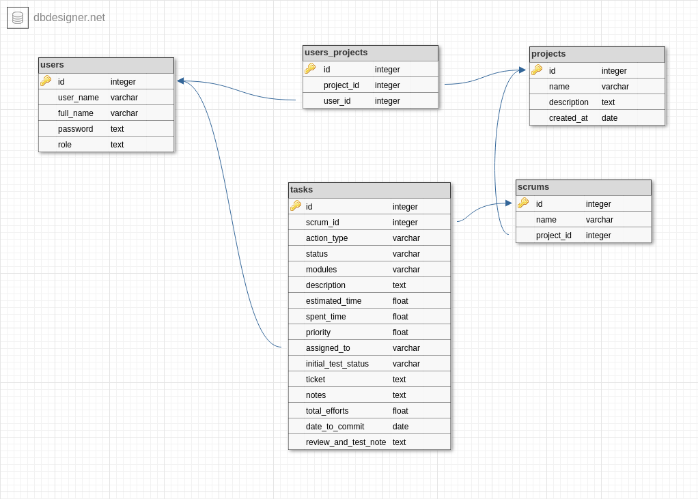

# logicteca

## Problem:

Mr. Mohanad faces big problem managing his projects scrum and tasks, he already use excell sheet to write down every scrum tasks and assign employee for that tasks. He always get lost with huge data. He asked us to help him manage these scrums and tasks within any project and also manage employees roles.

## Goal and Stakeholders

### Goals

    1- Build a management system to link project logs and scrums.
    2- The management system should link each task to its ticket.
    3- The management system should give three privilleges: scrum master, developper and finance manager.
    4- The management system should have a time tracher for each developper.
    5- The finance manager should be able to generate bills and invoices.

### Stakeholders

- Scrum master.
- Developper.
- finance manager.
- client

## Process Audit

- Google sheets.
- Bugnet system (ticketing & management system).

## Inspiration

- Sap (expensive).
- peoplesoft
- Google sheet and other similar design format.

## Specific goal

Be able to insert the Scrums tasks for a project.

## Main Stakeholder

- Scrum master.
- Admin

## Journy

As a scrum master, I can insert/edit/delete any scrum/task for my project.

## User Story

As a scrum master I can:

- Login to my account from login page.
- View projects and Add/edit/delete any project from projects page.
- view scrums/tasks for any project when I just click on that project name or double click project row on projects table.

As Admin I can do all tasks assigned to scrum master in addition to add/edit/delete any member from menber page.

## Prototype

Website prototype is [here](https://www.figma.com/file/f1Db5QWnotf9GRsGjYlr0zAs/Logicteca)

## Tweet

Easy and efficient mmanagement for projects

## Work flow (_inprogress...._)

The main project flow is divided into to main sprints

- **Front-end**
  We will use React and specially Atnd Components to create awesome tables, inputs ....etc.
- **Back-end**
  We will use Express server and postgres database.

## Database Schema:

## How to use

## Team:

Ayman, Israa, Angham and Amin.
